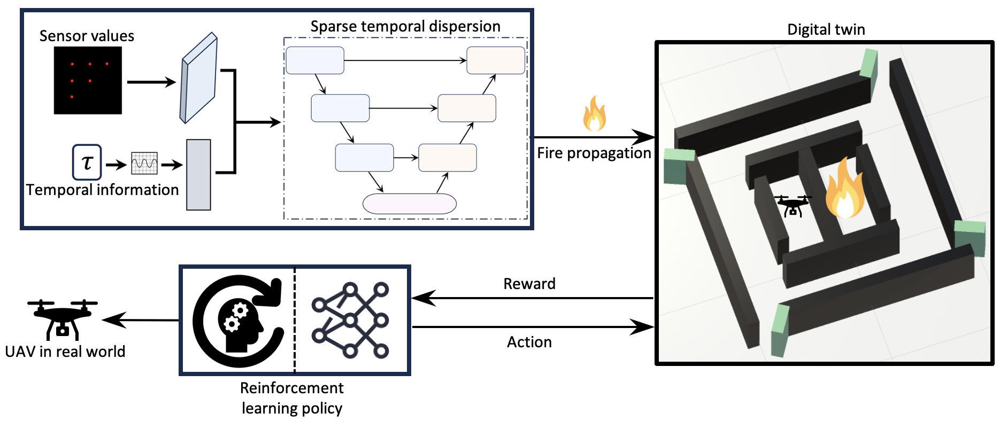

## Unifying Digital Twins, Generative AI, and Reinforcement Learning for UAV-assisted Effective Real-time Evacuation

### Abstract
Unmanned aerial vehicles (UAVs) have dramatically transformed evacuation missions, significantly enhancing the speed, precision, and safety of rescue operations. The revolutionary digital twin (DT) technology enables the simulation of UAVs in hazardous scenarios by providing a safe environment for scenario experimentation. However, the adaptability of DT to dynamically evolving scenarios remains challenging, and simulating a digital twin in such a scenario becomes a more significant problem. Additionally, autonomy in digital twins is under explored, which could be beneficial in hazardous situations. Recent advancements in Reinforcement Learning and Generative Artificial Intelligence (GenAI) present promising solutions to these challenges. This paper introduces a novel approach to UAV assisted indoor evacuation, incorporating digital twins, sparse temporal dispersion - a GenAI technique - and reinforcement learning to improve evacuation effectiveness in indoor fire scenarios. The methodology employs a sparse temporal dispersion model to simulate dynamic fires realistically within the digital twin environment. The fire simulations are overlayed onto the digital twin to create a dynamic platform conducive to real-time settings. The core of the approach involves employing reinforcement learning to train an indoor UAV agent for evacuation. This agent autonomously learns optimal evacuation strategies, navigating hazardous conditions to reach designated exit points. Extensive simulations validate the efficacy of the methodology with a 91% success rate and 60% faster evacuation time compared to baseline models, proving its efficacy in enhancing safety protocols and response strategies.

### Overall view of zero-shot denoising technique consisting of image downsampling, denoising neural network, and residual and consistency losses


### Citation
```
@article{mohammed2025unifying,
  title={Unifying Digital Twins, Generative AI, and Reinforcement Learning for UAV-assisted Effective Real-time Evacuation},
  author={Mohammed, Shahmir Khan and Singh, Shakti and Mizouni, Rabeb and Otrok, Hadi},
  journal={IEEE Transactions on Vehicular Technology},
  year={2025},
  publisher={IEEE}
}
```
